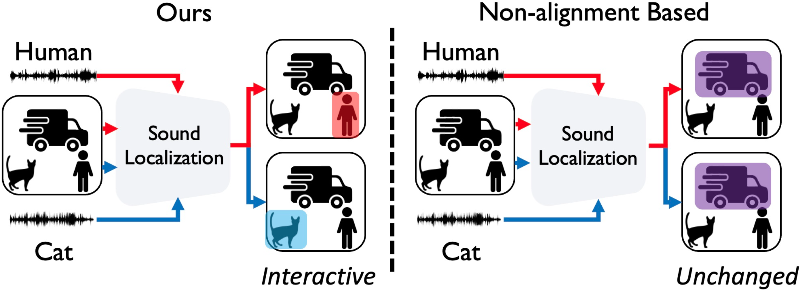

# Sound Source Localization is All About Alignment (ICCV’23)

Official PyTorch implementation of our following papers:

>  **[Sound Source Localization is All About Cross-Modal Alignment](https://openaccess.thecvf.com/content/ICCV2023/papers/Senocak_Sound_Source_Localization_is_All_about_Cross-Modal_Alignment_ICCV_2023_paper.pdf)**  
>
> [Arda Senocak*](https://ardasnck.github.io/), [Hyeonggon Ryu*](https://sites.google.com/view/hyeonggonryu), [Junsik Kim*](https://sites.google.com/site/jskimcv/), [Tae-Hyun Oh](https://ami.postech.ac.kr/members/tae-hyun-oh), [Hanspeter Pfister](https://vcg.seas.harvard.edu/people), [Joon Son Chung](https://mmai.io/joon/) (* Equal Contribution)
>
>  ICCV 2023

>  **[Aligning Sight and Sound: Advanced Sound Source Localization Through Audio-Visual Alignment](https://arxiv.org/abs/2407.13676)**  
>
> [Arda Senocak*](https://ardasnck.github.io/), [Hyeonggon Ryu*](https://sites.google.com/view/hyeonggonryu), [Junsik Kim*](https://sites.google.com/site/jskimcv/), [Tae-Hyun Oh](https://ami.postech.ac.kr/members/tae-hyun-oh), [Hanspeter Pfister](https://vcg.seas.harvard.edu/people), [Joon Son Chung](https://mmai.io/joon/) (* Equal Contribution)
>
>  arXiV 2024

## Index
- [Overview](#overview)
- [Interactive Synthetic Sound Source (IS3) Dataset](#interactive-synthetic-sound-source-is3-dataset)
- [Model Checkpoints](#model-checkpoints)
- [Demo](#demo)
- [Citation](#citation)

## Overview

<div align="center">
    
</div>

## Interactive Synthetic Sound Source (IS3) Dataset


*IS3 dataset is available [`here`](https://drive.google.com/file/d/1j-2sY6aJMS9kTpamaJM-4vg9eI-40VFB/view?usp=sharing)* or you can simply run download_is3.sh.

The IS3 data is organized as follows:

Note that in IS3 dataset, each annotation is saved as a separate file. For example; the sample `accordion_baby_10467` image contains two annotations for accordion and baby objects. These annotations are saved as `accordion_baby_10467_accordion` and `accordion_baby_10467_baby` for straightforward use. You can always project bounding boxes or segmentation maps onto the original image to see them all at once.

`images` and `audio_waw` folders contain all the image and audio files respectively. 

`IS3_annotation.json` file contains ground truth bounding box and category information of each annotation.

`gt_segmentation` folder contains segmentation maps in binary image format for each annotation. You can query the file name in `IS3_annotation.json` to get semantic category of each segmentation map.

## Model Checkpoints
The model checkpoints are available for the following experiments:

| Training Set                  | Test Set | Model Type | Performance (cIoU) | Checkpoint |
|--------------------------|:-------------:|:-------------:|:-------------:|:------------:|
| VGGSound-144K           |  VGG-SS       | NN w/ Sup. Pre. Enc.        | 39.94      | [Link](https://drive.google.com/file/d/1-WUEoAmp4WBj4Tbsi9Ybh2bq4W6-uYnd/view?usp=drive_link) |
| VGGSound-144K           |  VGG-SS       | NN w/ Self-Sup. Pre. Enc.        | 39.16       | [Link](https://drive.google.com/file/d/1p_eXOlZfeCo5EwY5RRkh4YnAnMZJ0Eyz/view?usp=drive_link) |
| VGGSound-144K           |  VGG-SS       | NN w/ Sup. Pre. Enc. Pre-trained Vision       | 41.42       | [Link](https://drive.google.com/file/d/1FYv6Pt8k8MdHlBHDCaMVGtWZN_UXh_GJ/view?usp=drive_link) |
| Flickr-SoundNet-144K           |  Flickr-SoundNet       | NN w/ Sup. Pre. Enc.        | 85.20      | [Link](https://drive.google.com/file/d/1R_LEEcUEnwREvt_ducCdnEVUI6VHvnqv/view?usp=drive_link) |
| Flickr-SoundNet-144K           |  Flickr-SoundNet       | NN w/ Self-Sup. Pre. Enc.        | 84.80      | [Link](https://drive.google.com/file/d/1HHnUc3sERGrCjUbHklS9uDdA5yxjRtKB/view?usp=drive_link) |
| Flickr-SoundNet-144K           |  Flickr-SoundNet       | NN w/ Sup. Pre. Enc. Pre-trained Vision         | 86.00      | [Link](https://drive.google.com/file/d/1zs0gr1_QVfonw0Q2VVbExwUUDhJSUH35/view?usp=drive_link) |

## Demo

We provide a zip file that contains model checkpoints and a few data samples from VGGSound.

https://mm.kaist.ac.kr/share/kccv_tutorial.zip

Download the dataset and set up the environment as described below.

```
sh environment.sh
sh download_is3.sh
```

Now enjoy the Sound Localization Demo.ipynb!

## Citation
If you find this code useful, please consider giving a star ⭐ and citing us:

```bibtex
@inproceedings{senocak2023sound,
  title={Sound source localization is all about cross-modal alignment},
  author={Senocak, Arda and Ryu, Hyeonggon and Kim, Junsik and Oh, Tae-Hyun and Pfister, Hanspeter and Chung, Joon Son},
  booktitle={Proceedings of the IEEE/CVF International Conference on Computer Vision},
  pages={7777--7787},
  year={2023}
}
```
If you use this dataset, please consider giving a star ⭐ and citing us:

```bibtex
@article{senocak2024align,
  title={Aligning Sight and Sound: Advanced Sound Source Localization Through Audio-Visual Alignment},
  author={Senocak, Arda and Ryu, Hyeonggon and Kim, Junsik and Oh, Tae-Hyun and Pfister, Hanspeter and Chung, Joon Son},
  journal={arXiv preprint arXiv:2407.13676},
  year={2024}
}
```
# ssl_kccv
